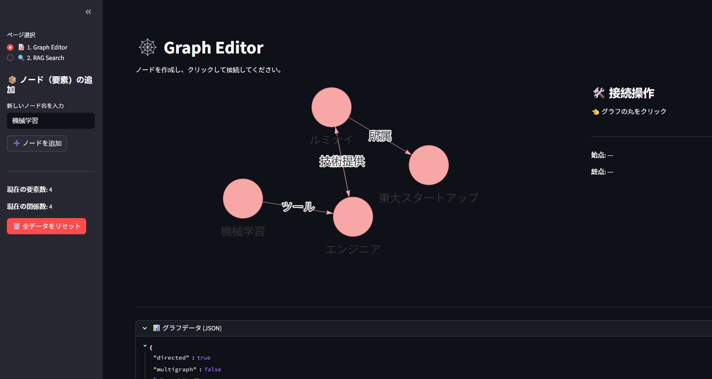
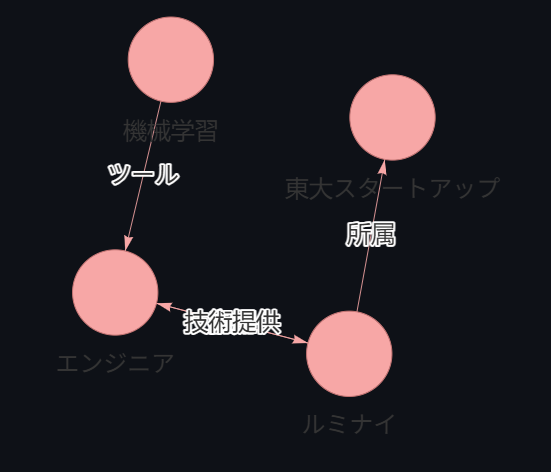
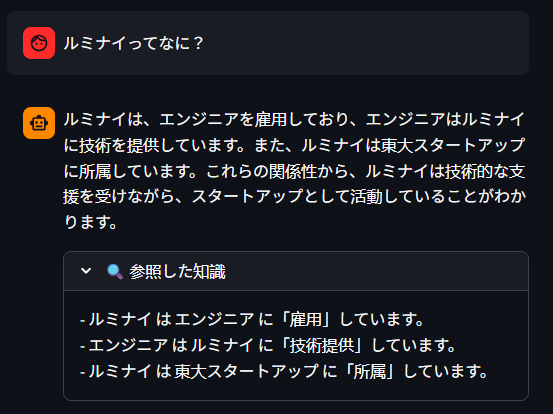

## 🕸️ はじめに：なんでわざわざ「手動」でグラフを作るの？

こんにちは！ ルミナイR&Dチームの宮脇彰梧です。

みなさん、**RAG** やってますか？
最近、この界隈でめちゃくちゃ熱いのが **「GraphRAG（ナレッジグラフ活用）」** ですよね。

ドキュメントをただのテキストとして扱うだけじゃなくて、「ノード」と「エッジ」のネットワークとして捉えちゃうやつです。これを使うと、普通のベクトル検索じゃ答えられないような、「AとCは、実はBを介して繋がってるよね？」みたいな高度な推論ができるようになります。

でも……既存のGraphRAGツール（Microsoftのやつとか、LangChainの自動構築機能とか）を触っていて、正直思ったんです。

**「これ、AIが勝手に作ったグラフが間違ってたら、どうすんの？」って。**

グラフデータベースの中身なんて、エンジニアしか見れません。でも、その業務の「正解」を知ってるのは、コードを書かない現場の専門家たちですよね。
彼らが「ここ、繋がってないよ！」とか「この関係は違うよ！」って指摘できない限り、RAGはずっと「なんか惜しいシステム」のままなんじゃないか……？

そこで閃きました。
**「PowerPointで図形を繋ぐみたいな感覚で、誰でもポチポチとナレッジグラフを作れるツールがあれば、最強のRAGが作れるんじゃね？」**

この記事は、そんな思いつきからスタートして、Pythonの **Streamlit** で **「GraphRAG Visual Editor」** を爆速開発し、いろんな技術の壁にぶつかりながら進化させていった記録です。



**前回の記事**

https://zenn.dev/lonebula/articles/887299dcd1d90d

## Phase 1: エディタ機能

### コンセプト: "Curated" Graph RAG

目指したのは、AI任せの全自動じゃなくて、**「人間がガッツリ介入する（Human-in-the-loop）」** ワークフローです。

1. **人間がGUIで** ノードを作って、線を繋ぐ。
2. その「人の手で保証された知識」を、RAGの脳みそとして使う。

この「2」を実現するために選んだ技術スタックはこれ！

* **UIフレームワーク**: [Streamlit](https://streamlit.io/)
* PythonだけでWebアプリが作れる神ツール。今回はこれ一択。


* **グラフ操作**: [NetworkX](https://networkx.org/)
* Python界のグラフ操作のデファクトスタンダード。


* **可視化**: `streamlit-agraph`
* グリグリ動くグラフ描画コンポーネント。


### こだわりポイント：「クリック接続」UI

Webブラウザ上で「マウスで線をグイッと引っ張って繋ぐ」実装って、実は結構めんどくさいんです（Reactとか書かないといけないし…）。

そこで今回は、もっとシンプルで確実な **「始点をクリック → 終点をクリック」** という2ステップ方式を採用しました！

```python
# (app.pyの一部抜粋：接続ロジック)
with col_control:
    # ... (中略) ...
    src = st.session_state['source_node']
    tgt = st.session_state['target_node']
    
    # 始点と終点が選ばれてたら入力フォームを出す
    if src and tgt and src != tgt:
        relation_label = st.text_input("関係名 (例: 所属)", key="rel_input")
        
        if st.button("🔗 接続する"):
            # NetworkXにエッジを追加！
            st.session_state['graph'].add_edge(src, tgt, relation=relation_label)
            
            # 選んでた状態をリセットして再描画
            st.session_state['source_node'] = None
            st.session_state['target_node'] = None
            st.rerun()

```

これなら誤操作も少ないし、非エンジニアの人でも迷わず「知識の接続」ができますよね。


## Phase 2: RAGチャット機能

エディタでグラフが作れるようになったら、次はやっぱり **「そのグラフと会話したい」** ですよね？
というわけで、アプリを2ページ構成にして、**「Graph RAG Chat」** 機能を追加しました。

### 検索ロジック：サブグラフ抽出

ここで一番のポイントは、「どうやってグラフから必要な情報を取ってくるか」。
今回はシンプルかつ強力な作戦でいきました。

1. ユーザーの質問文にあるキーワードと一致するノードを探す。
2. そのノードに **直接繋がってる線（1ホップ）** を全部引っ張ってくる。
3. それをテキスト化して、LLMに「これを使って答えて！」と投げる。

```python
# (RAG検索ロジックの抜粋)
def retrieve_context(query, graph):
    # ... (キーワードマッチング処理) ...

    # 2. サブグラフ抽出
    for node in found_nodes:
        # 自分から出ていく矢印 (Outgoing)
        for neighbor in graph.neighbors(node):
            rel = graph.get_edge_data(node, neighbor).get('relation', 'related')
            triplets.append(f"- {node} は {neighbor} に「{rel}」しています。")
        
        # 自分に入ってくる矢印 (Incoming) も忘れずに！
        for predecessor in graph.predecessors(node):
            # ... (同様に処理) ...
            
    return "\n".join(set(triplets))

```

これで、巨大なグラフ全体をLLMに読ませる必要がなくなります。質問に関係あるピンポイントな知識だけを渡せるので、回答精度も上がるしコストも安上がり。一石二鳥です。


## Phase 3: バグ修正と改善の記録

プロトタイプは動きました。「おっしゃ完成！」と思ったのも束の間、実用化しようとしたら **いくつかの「技術的な壁」** に激突しました…。
ここからは、そのエラーとの戦いの記録です。

### 🛑 壁1：ライブラリのバージョン依存 (`KeyError: 'links'`)

**現象:**
検索キーワードがヒットしなかった時、なぜかアプリが落ちる…。

**原因:**
NetworkXって、バージョンによって `node_link_data` で吐き出すJSONのキー名が違うんです！ 古いと `'links'`、新しいと `'edges'` だったりする。なんてこった。

**対策:**
「どっちが来ても大丈夫なように書く」のが正義です。

```python
# 修正前（決め打ちしてた…）
# all_links = data['links'] 

# 修正後（.get() と or で安全に取得！）
data = nx.node_link_data(graph)
all_links = data.get('links') or data.get('edges') or []

```

### 🛑 壁2：プロンプト内の競合 (`Invalid Prompt Input`)

**現象:**
グラフデータの中に「ツール」みたいなデータを入れたら、LangChainがエラーを吐いて止まりました。

**原因:**
LangChainのプロンプトテンプレートって、`{ }` を「変数の埋め込み場所」として認識するんですよね。だから、データの中に `{` (波括弧) が入ってると、「おっ、ここに変数を埋め込むんだな？ …あれ？ そんな変数渡されてないぞ！」って怒られちゃうんです。

**対策:**
f-stringでプロンプトを作るのをやめて、LangChainのお作法通りに「変数」として渡すようにしました。

```python
# 修正前 (f-stringで文字列に埋め込んでいた。これがNG)
# system_prompt = f"... {context} ..."

# 修正後 (テンプレートとして定義して、invokeの時に渡す)
system_prompt = """... {context} ..."""
# ...
chain.invoke({
    "input": prompt,
    "context": context  # ここで渡せば、中身に {} があっても大丈夫！
})

```

### 🛑 壁3：AIが真面目すぎる問題

**現象:**
グラフには「AはBに所属している」って書いてあるのに、「Bって何？」って聞くと、AIが **「分かりません」** って答えちゃうんです。

**原因:**
プロンプトで「既知の事実 **のみ** に基づいて答えて」って厳しく言い過ぎてました。AI君、「Bの定義なんてどこにも書いてないじゃないですか！ 勝手なこと言えません！」って萎縮しちゃったんですね。

**対策:**
もっと優しく、柔軟に誘導してあげましょう。

```markdown
# 修正後のプロンプト（抜粋）
【回答のルール】
1. 「〇〇とは何か？」と聞かれた時、定義がなくても、それに繋がってる他の関係性について説明していいよ。
2. 文脈にある事実は全部使ってね。

```

これでAI君も、「定義は書いてないけど、Aさんが所属してる会社ですよ！」みたいに、空気を読んで答えてくれるようになりました。

## 全コード

```python
import streamlit as st
from streamlit_agraph import agraph, Node, Edge, Config
import networkx as nx
from langchain_openai import ChatOpenAI
from langchain_core.prompts import ChatPromptTemplate
from langchain_core.output_parsers import StrOutputParser

# ---------------------------------------------------------
# 0. 全体設定とセッション管理
# ---------------------------------------------------------
st.set_page_config(page_title="GraphRAG Visual Editor", layout="wide", page_icon="🕸️")

# グラフデータ（NetworkX）をセッションで保持
if 'graph' not in st.session_state:
    st.session_state['graph'] = nx.DiGraph()

# 接続操作用のステート（始点と終点を保持）
if 'source_node' not in st.session_state:
    st.session_state['source_node'] = None
if 'target_node' not in st.session_state:
    st.session_state['target_node'] = None

# チャット履歴
if "messages" not in st.session_state:
    st.session_state.messages = []

# APIキー管理
if "openai_api_key" not in st.session_state:
    st.session_state.openai_api_key = ""

# ---------------------------------------------------------
# 1. ページ定義
# ---------------------------------------------------------

def page_editor():
    """1ページ目: グラフエディタ"""
    st.title("🕸️ Graph Editor")
    st.markdown("ノードを作成し、クリックして接続してください。")

    # --- サイドバー：ノード追加 ---
    st.sidebar.header("📦 ノード（要素）の追加")
    new_node = st.sidebar.text_input("新しいノード名を入力", placeholder="例: ルミナイ株式会社")

    if st.sidebar.button("➕ ノードを追加"):
        if new_node:
            if not st.session_state['graph'].has_node(new_node):
                st.session_state['graph'].add_node(new_node)
                st.sidebar.success(f"追加しました: {new_node}")
            else:
                st.sidebar.warning("そのノードは既に存在します。")
        else:
            st.sidebar.warning("ノード名を入力してください。")

    st.sidebar.divider()
    st.sidebar.markdown(f"**現在の要素数:** {st.session_state['graph'].number_of_nodes()}")
    st.sidebar.markdown(f"**現在の関係数:** {st.session_state['graph'].number_of_edges()}")

    if st.sidebar.button("🗑️ 全データをリセット", type="primary"):
        st.session_state['graph'].clear()
        st.session_state['source_node'] = None
        st.session_state['target_node'] = None
        st.session_state['messages'] = []
        st.rerun()

    # --- メインエリア：可視化と操作 ---
    col_graph, col_control = st.columns([3, 1])

    with col_graph:
        nodes = []
        edges = []
        # ノード設定
        for n in st.session_state['graph'].nodes():
            color = "#F7A7A6" # Default Pink
            if n == st.session_state['source_node']:
                color = "#5D5CDE" # Blue for Source
            elif n == st.session_state['target_node']:
                color = "#4CAF50" # Green for Target
            nodes.append(Node(id=n, label=n, size=25, color=color))

        # エッジ設定
        for u, v, d in st.session_state['graph'].edges(data=True):
            edges.append(Edge(source=u, target=v, label=d.get('relation', ''), type="CURVE_SMOOTH"))

        config = Config(width="100%", height=500, directed=True, 
                        nodeHighlightBehavior=True, highlightColor="#F7A7A6",
                        collapsible=False, physics=True)

        selected_node_id = agraph(nodes=nodes, edges=edges, config=config)

    with col_control:
        st.subheader("🛠️ 接続操作")
        if selected_node_id:
            st.info(f"選択中: **{selected_node_id}**")
            c1, c2 = st.columns(2)
            with c1:
                if st.button("始点に設定"):
                    st.session_state['source_node'] = selected_node_id
                    st.rerun()
            with c2:
                if st.button("終点に設定"):
                    st.session_state['target_node'] = selected_node_id
                    st.rerun()
        else:
            st.write("👈 グラフの丸をクリック")

        st.divider()

        src = st.session_state['source_node']
        tgt = st.session_state['target_node']
        st.write(f"**始点:** {src if src else '---'}")
        st.write(f"**終点:** {tgt if tgt else '---'}")

        if src and tgt and src != tgt:
            relation_label = st.text_input("関係名 (例: 所属)", key="rel_input")
            if st.button("🔗 接続する"):
                if relation_label:
                    st.session_state['graph'].add_edge(src, tgt, relation=relation_label)
                    st.session_state['source_node'] = None
                    st.session_state['target_node'] = None
                    st.success("接続完了")
                    st.rerun()
                else:
                    st.error("関係名を入力してください")
        
        if src or tgt:
            if st.button("選択クリア"):
                st.session_state['source_node'] = None
                st.session_state['target_node'] = None
                st.rerun()
    
    # JSON確認用
    st.divider()
    with st.expander("📊 グラフデータ (JSON)"):
        st.json(nx.node_link_data(st.session_state['graph']))


def page_rag():
    """2ページ目: RAG検索（OpenAI利用）"""
    st.title("💬 Graph RAG Chat")
    st.markdown("作成したナレッジグラフに基づいて質問できます。")

    # APIキー入力
    api_key = st.text_input("OpenAI API Key", type="password", value=st.session_state.openai_api_key)
    if api_key:
        st.session_state.openai_api_key = api_key
    
    if not st.session_state.openai_api_key:
        st.warning("チャットを行うにはOpenAI APIキーを入力してください。")
        return

    st.divider()

    # --- RAG ロジック (修正版) ---
    def retrieve_context(query, graph):
        """グラフから関連情報を検索する簡易ロジック"""
        triplets = []
        found_nodes = []
        
        # 1. キーワードマッチ（質問文に含まれるノードを探す）
        for node in graph.nodes():
            if node in query:
                found_nodes.append(node)
        
        if not found_nodes:
            # マッチしない場合は全ノード情報を返す
            data = nx.node_link_data(graph)
            # 修正箇所: バージョン依存のキーエラーを防ぐため .get() を使用
            all_links = data.get('links') or data.get('edges') or []
            
            return "（キーワードに一致するノードが見つかりませんでした。全知識を参照します）\n" + str(all_links)

        # 2. サブグラフ抽出（見つかったノードに接続するエッジを取得）
        for node in found_nodes:
            # Outgoing
            for neighbor in graph.neighbors(node):
                rel = graph.get_edge_data(node, neighbor).get('relation', 'related')
                triplets.append(f"- {node} は {neighbor} に「{rel}」しています。")
            # Incoming
            for predecessor in graph.predecessors(node):
                rel = graph.get_edge_data(predecessor, node).get('relation', 'related')
                triplets.append(f"- {predecessor} は {node} に「{rel}」しています。")
        
        return "\n".join(set(triplets))

    # --- チャットUI ---
    # 履歴表示
    for msg in st.session_state.messages:
        with st.chat_message(msg["role"]):
            st.markdown(msg["content"])

    # 入力処理
    if prompt := st.chat_input("グラフについて聞いてください..."):
        # ユーザーの入力を表示
        st.session_state.messages.append({"role": "user", "content": prompt})
        with st.chat_message("user"):
            st.markdown(prompt)

        # 検索 (Retrieval)
        context = retrieve_context(prompt, st.session_state['graph'])

        # LLM生成 (Generation)
        try:
            llm = ChatOpenAI(model="gpt-4o-mini", api_key=st.session_state.openai_api_key, temperature=0)
            
            # ▼▼▼ プロンプトを修正（ここから） ▼▼▼
            system_prompt = """
            あなたはナレッジグラフを持つAIアシスタントです。
            ユーザーの質問に対し、以下の【既知の事実 (Context)】にある情報を『最大限活用して』答えてください。
            
            【回答のルール】
            1. 「〇〇とは何か？」と聞かれた際、定義がなくても、それに接続している他のノード（関係性）について説明してください。
            2. 文脈にある事実はすべて回答に含めてください。
            3. 文脈に全く関連情報がない場合のみ、「グラフからは分かりません」と答えてください。

            【既知の事実 (Context)】
            {context}
            """
            # ▲▲▲ プロンプトを修正（ここまで） ▲▲▲
            
            chat_template = ChatPromptTemplate.from_messages([
                ("system", system_prompt),
                ("user", "{input}")
            ])
            chain = chat_template | llm | StrOutputParser()
            
            with st.chat_message("assistant"):
                # contextを変数として渡す（前の修正と同じ）
                response = chain.invoke({
                    "input": prompt,
                    "context": context
                })
                st.markdown(response)
                
                # デバッグ用に参照したコンテキストを表示
                with st.expander("🔍 参照した知識"):
                    st.text(context)
            
            st.session_state.messages.append({"role": "assistant", "content": response})

        except Exception as e:
            st.error(f"エラーが発生しました: {e}")


# ---------------------------------------------------------
# 2. ナビゲーション制御
# ---------------------------------------------------------
# サイドバーでページ切り替え
page = st.sidebar.radio("ページ選択", ["📝 1. Graph Editor", "🔍 2. RAG Search"])

if page == "📝 1. Graph Editor":
    page_editor()
elif page == "🔍 2. RAG Search":
    page_rag()

```

## 実際に動かしてみた

Q:「ルミナイってなに？」





私が手で繋いだ「雇用」「技術提供」「所属」という関係性を、AIがちゃんと理解して、自然な日本語で説明してくれています。 ただのキーワード検索じゃなくて、「構造化された知識」 として扱われているのが分かりますね。

## 🕸️ まとめ

こうして、小さな「あったらいいな」から始まった GraphRAG Visual Editor は、なんとか検索と生成のサイクルを回せる実用的なプロトタイプまで育ちました。

やっぱり 「人間が目で見て、手で直せる」 安心感ってすごくないですか？ ブラックボックスになりがちなAIシステムですが、こうやってドメイン専門家がポチポチとグラフを育てていく形なら、現場でも自信を持って使える気がします。

---

*執筆：宮脇 彰梧（ルミナイ株式会社 / Lluminai）*

---

**GraphRAGの記事**

https://zenn.dev/lluminai_tech/articles/9806db6aa05a5c

https://zenn.dev/lluminai_tech/articles/1beb0baf8b78e0

https://zenn.dev/lonebula/articles/887299dcd1d90d

---

【現在採用強化中です！】
- AIエンジニア
- PM/PdM
- 戦略投資コンサルタント

▼代表とのカジュアル面談URL
https://pitta.me/matches/VCmKMuMvfBEk